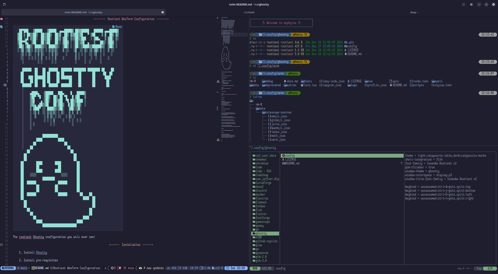

# Rootiest WezTerm Configuration

```none
 ██▀███   ▒█████   ▒█████  ▄▄▄█████▓ ██▓▓█████   ██████ ▄▄▄█████▓
▓██ ▒ ██▒▒██▒  ██▒▒██▒  ██▒▓  ██▒ ▓▒▓██▒▓█   ▀ ▒██    ▒ ▓  ██▒ ▓▒
▓██ ░▄█ ▒▒██░  ██▒▒██░  ██▒▒ ▓██░ ▒░▒██▒▒███   ░ ▓██▄   ▒ ▓██░ ▒░
▒██▀▀█▄  ▒██   ██░▒██   ██░░ ▓██▓ ░ ░██░▒▓█  ▄   ▒   ██▒░ ▓██▓ ░
░██▓ ▒██▒░ ████▓▒░░ ████▓▒░  ▒██▒ ░ ░██░░▒████▒▒██████▒▒  ▒██▒ ░
░ ▒▓ ░▒▓░░ ▒░▒░▒░ ░ ▒░▒░▒░   ▒ ░░   ░▓  ░░ ▒░ ░▒ ▒▓▒ ▒ ░  ▒ ░░
  ░▒ ░ ▒░  ░ ▒ ▒░   ░ ▒ ▒░     ░     ▒ ░ ░ ░  ░░ ░▒  ░ ░    ░
  ░░   ░ ░ ░ ░ ▒  ░ ░ ░ ▒    ░       ▒ ░   ░   ░  ░  ░    ░
   ░         ░ ░      ░ ░            ░     ░  ░      ░

   ██████  ██   ██  ██████  ███████ ████████ ████████ ██    ██
  ██       ██   ██ ██    ██ ██         ██       ██     ██  ██
  ██   ███ ███████ ██    ██ ███████    ██       ██      ████
  ██    ██ ██   ██ ██    ██      ██    ██       ██       ██
   ██████  ██   ██  ██████  ███████    ██       ██       ██

        ▄████▄   ▒█████   ███▄    █   █████▒
        ▒██▀ ▀█  ▒██▒  ██▒ ██ ▀█   █ ▓██   ▒
        ▒▓█    ▄ ▒██░  ██▒▓██  ▀█ ██▒▒████ ░
        ▒▓▓▄ ▄██▒▒██   ██░▓██▒  ▐▌██▒░▓█▒  ░
        ▒ ▓███▀ ░░ ████▓▒░▒██░   ▓██░░▒█░
        ░ ░▒ ▒  ░░ ▒░▒░▒░ ░ ▒░   ▒ ▒  ▒ ░
        ░  ▒     ░ ▒ ▒░ ░ ░░   ░ ▒░ ░
        ░        ░ ░ ░ ▒     ░   ░ ░  ░ ░
        ░ ░          ░ ░           ░
        ░

                ██████████
            ████          ████
          ██                  ██
        ██                      ██
      ██                          ██
    ██                              ██
    ██                              ██
  ██        ████        ████          ██
  ██        ██            ██          ██
  ██        ████        ████          ██
  ██    ░░░░                ░░░░      ██
  ██            ████████              ██
  ██  ██████              ██████      ██
  ██        ██          ██            ██
  ██        ██          ██            ██
  ██  ██████              ██████        ██    ██
  ██                                      ████  ██
    ██                                          ██
    ██                                          ██
      ██                                      ██
        ██                                    ██
          ██                              ████
            ████                      ████
                ██████████████████████
```

The rootiest Ghostty configuration you will ever see!

## Installation

1. Install [Ghostty](https://ghostty.org/download)

2. Install pre-requisites

   - Required
     - [Rootiest Iosevka fonts](./fonts/README.md)
   - Optional
     - [fish](https://fishshell.com/)
     - [neovim](https://neovim.io/)

3. Backup your current Ghostty configuration (if you have one)

   ```bash
   mv ~/.config/ghostty ~/.config/ghostty.bak
   ```

4. Clone the repository

   ```bash
   git clone https://github.com/rootiest/rootiest-ghostty.git ~/.config/ghostty
   ```

5. **Enjoy!** 🎉

## Features

- Smart key bindings
- Splits and panes integrate seamlessly with NeoVim
- Seamless integration with fish shell
- Catppuccin theme by default
- Integrates cleanly with other Rootiest projects

## Screenshots



## Companion Tools

[Rootiest Fish Conf](https://github.com/rootiest/rootiest-fish) -
Fish shell configuration that pairs well with this WezTerm configuration
and the NeoVim configuration.

[Rootiest Tmux](https://github.com/rootiest/rootiest-tmux) -
A tmux configuration that is designed to work with this WezTerm config.

[Rootiest Neovim](https://github.com/rootiest/rootiest-nvim) -
A NeoVim config built to work alongside this and the fish config.

[Rootiest Iosevka Font](https://github.com/rootiest/rootiest-iosevka) -
A custom Iosevka font that is designed by developers, for developers.

[Nerd Fonts](https://github.com/ryanoasis/nerd-fonts/) -
A collection of fonts that include many icons and glyphs that are used in this configuration.

## Dotfiles

[Rootiest Dotfiles](https://github.com/rootiest/dotfiles)

## Credits

- [ghostty](https://github.com/ghostty-org/ghostty)
